# LinkedIn Scraper & Crawler

A modular Python system for scraping LinkedIn profile data and automating LinkedIn interactions. Built with **Playwright** for browser automation and **Scrapy Selectors** for robust HTML parsing.

---

## Features

- **Profile Data Extraction** — Parse LinkedIn profile HTML into structured JSON
- **Connection Automation** — Send connection requests with optional personalized notes
- **Defensive Selectors** — Multiple XPath fallbacks to survive LinkedIn UI changes
- **Page Object Model** — Clean separation between business logic and selectors
- **Session Persistence** — Reuse browser sessions to avoid repeated logins
- **Stealth Mode** — Chrome args configured to reduce automation detection

---

## Tech Stack

| Component | Technology |
|-----------|------------|
| Browser Automation | Playwright (async) |
| HTML Parsing | Scrapy Selectors + XPath |
| Configuration | TOML |
| Language | Python 3.11+ |

---

## System Architecture

The system is composed of two main layers that can operate independently:

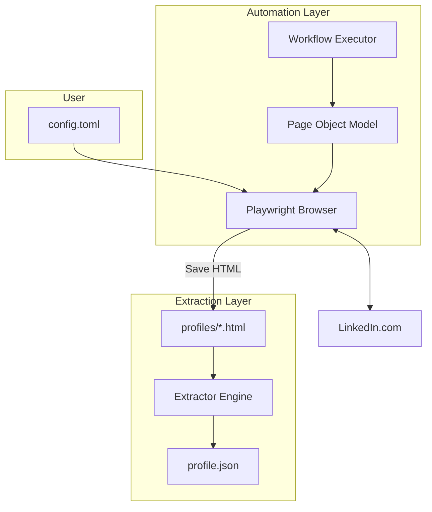

### Data Flow Overview

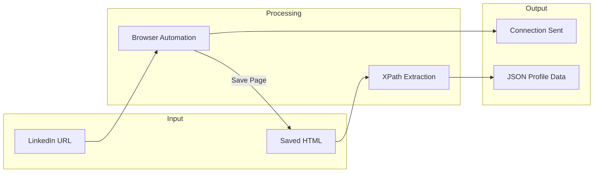

---

## Project Structure

```
LinkedInNode/
├── browser.py                 # Browser factory & config loader
├── config.toml                # Browser & context configuration
├── parser_executor.py         # Main extraction orchestrator
├── workflow_executor.py       # Main automation entry point
├── send_connection_request.py # Standalone connection script
│
├── extractors/                # HTML Parsing Engine
│   ├── base.py                # BaseExtractor with fallback logic
│   ├── registry.py            # Centralized XPath selectors
│   ├── utils.py               # Text cleaning utilities
│   ├── header.py              # Name, headline, location, about
│   ├── metrics.py             # Followers, connections count
│   ├── section.py             # Generic section extractor
│   ├── experience.py          # Work experience extraction
│   └── education.py           # Education extraction
│
├── linkedin/                  # Automation Layer
│   ├── linkedin_types.py      # Enums (ConnectionStatus, etc.)
│   └── pages/
│       ├── profile_page.py    # Profile page business logic
│       └── selectors/
│           ├── base_page.py   # BasePage with defensive locators
│           ├── profile_page.py# LinkedInProfilePageSelectors
│           └── core/
│               ├── profile_page.py  # PROFILE_PAGE_SELECTORS dict
│               └── keys/
│                   └── profile_page.py  # ProfilePageKey enum
│
└── profiles/                  # Saved HTML files for parsing
    ├── profile1.html
    ├── profile2.html
    └── ...
```

---

## Extractor Architecture

The extraction engine uses a class hierarchy with centralized selector management:

### Class Hierarchy

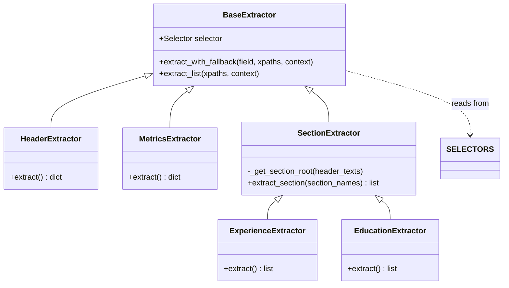

### How Extractors Work

Each extractor:
1. Receives a Scrapy `Selector` object (parsed HTML)
2. Looks up XPath patterns from the centralized `SELECTORS` registry
3. Tries each XPath in order until one succeeds (fallback strategy)
4. Returns cleaned, normalized data

---

## Selector Registry

All XPath selectors are centralized in `extractors/registry.py`:

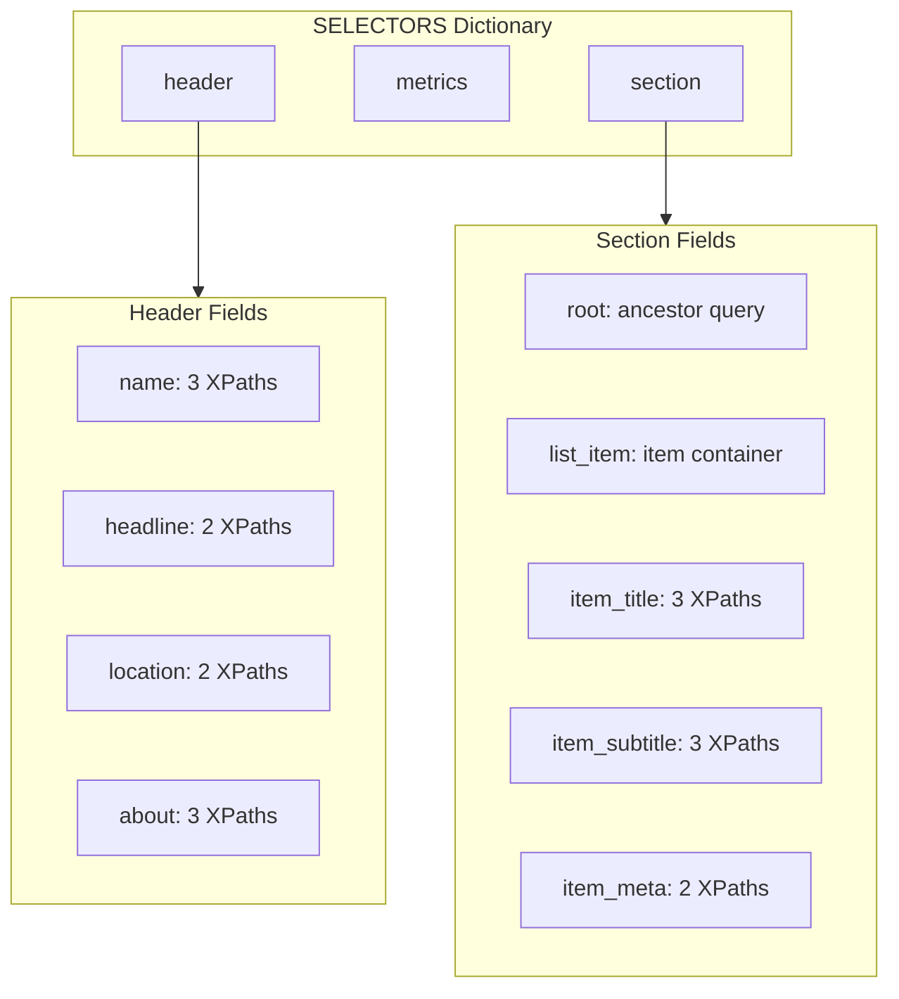

### Fallback Strategy

The `extract_with_fallback()` method iterates through XPaths until one returns data:

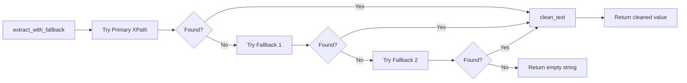

**Example from registry:**

```python
"name": [
    '//h1[contains(@class, "text-heading-xlarge")]/text()',  # Primary
    "//h1//text()",                                           # Fallback
    '//*[@id="ember33"]/h1/text()',                          # Last resort
]
```

---

## Extraction Flow

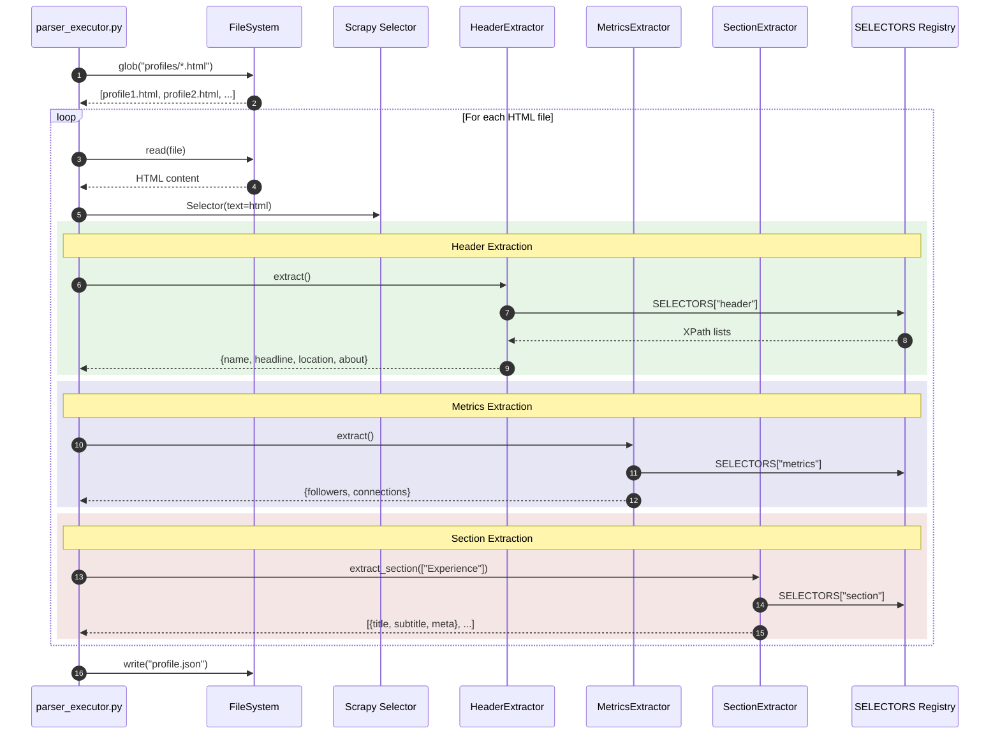

---

## Page Object Model (Automation)

The automation layer uses a defensive Page Object Model pattern:

### Architecture

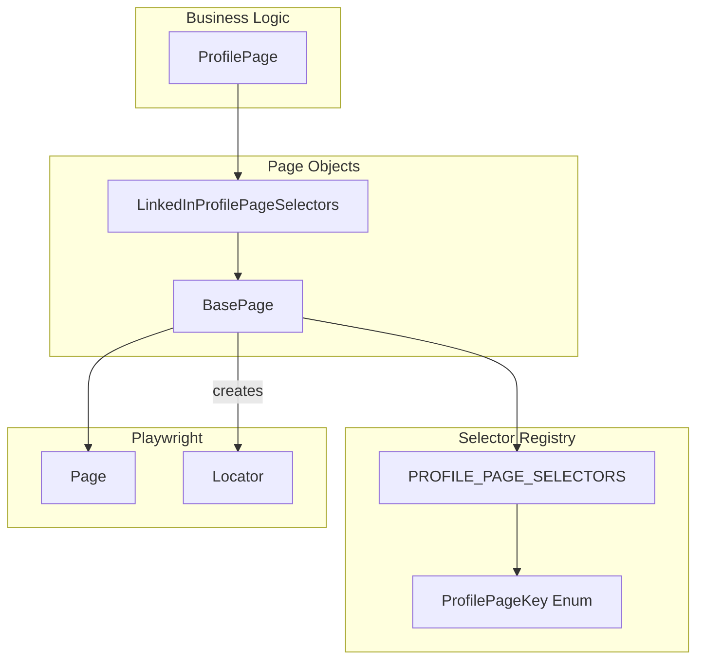

### Key Components

| Component | File | Purpose |
|-----------|------|---------|
| `ProfilePage` | `linkedin/pages/profile_page.py` | Business logic (send connection, check status) |
| `LinkedInProfilePageSelectors` | `linkedin/pages/selectors/profile_page.py` | Semantic methods returning Locators |
| `BasePage` | `linkedin/pages/selectors/base_page.py` | Defensive `_get_locator()` with `.or_()` chaining |
| `PROFILE_PAGE_SELECTORS` | `linkedin/pages/selectors/core/profile_page.py` | XPath dictionary |
| `ProfilePageKey` | `linkedin/pages/selectors/core/keys/profile_page.py` | Enum keys for selectors |

---

## Defensive Locator Resolution

The `_get_locator()` method chains multiple selectors using Playwright's `.or_()`:

```mermaid
flowchart TB
    subgraph call [Method Call]
        Request["profile.connect_button()"]
    end
    
    subgraph lookup [Registry Lookup]
        Key["ProfilePageKey.CONNECT_BUTTON"]
        Selectors["[xpath1, xpath2, xpath3]"]
    end
    
    subgraph chain [Locator Chaining]
        L1["locator(xpath1)"]
        L2["locator(xpath2)"]
        L3["locator(xpath3)"]
        Combined["L1.or_(L2).or_(L3)"]
    end
    
    subgraph result [Result]
        Robust["Robust Locator"]
        Note["Any match = success"]
    end
    
    Request --> Key
    Key --> Selectors
    Selectors --> L1
    Selectors --> L2
    Selectors --> L3
    L1 --> Combined
    L2 --> Combined
    L3 --> Combined
    Combined --> Robust
    Robust --> Note
```

**Example Selector Definition:**

```python
ProfilePageKey.CONNECT_BUTTON: [
    "//button[contains(@aria-label, 'Connect')]",  # ARIA-based
    "//button[.//span[text()='Connect']]",         # Text content
    "//button[text()='Connect']",                  # Direct text
]
```

---

## Connection Workflow

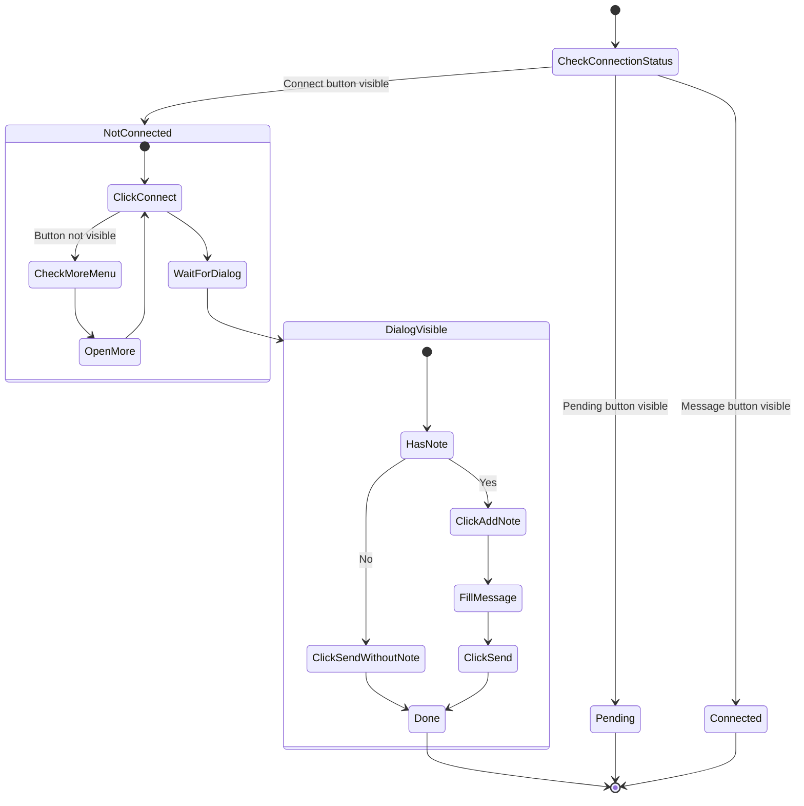

### Connection Status Detection

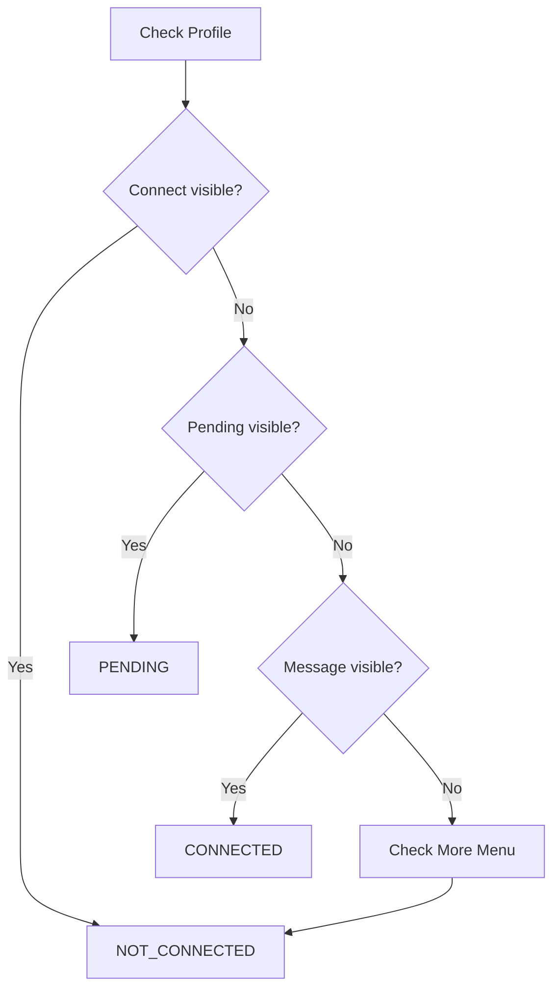

---

## Configuration

### config.toml Structure

```toml
[browser]
headless = false
args = [
    '--no-sandbox',
    '--disable-blink-features=AutomationControlled',
    '--disable-dev-shm-usage',
    # ... stealth flags
]

[context]
user_data_dir = "./chrome_user_data"
user_agent = "Mozilla/5.0 ..."
```

### Browser Configuration Flow

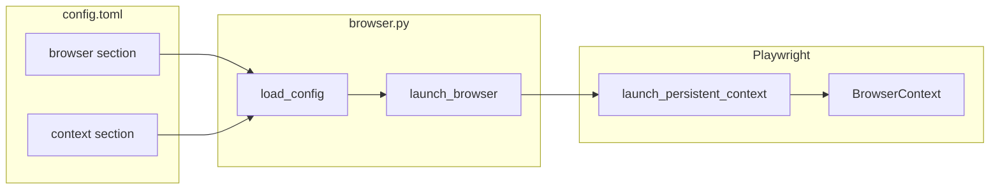

### Stealth Features

| Flag | Purpose |
|------|---------|
| `--disable-blink-features=AutomationControlled` | Removes `navigator.webdriver` flag |
| `--no-sandbox` | Required for some environments |
| `--disable-dev-shm-usage` | Prevents shared memory issues |
| `user_data_dir` | Persists cookies/session between runs |

---

## Quick Start

### Prerequisites

```bash
# Python 3.11+
python --version

# Install dependencies
pip install playwright scrapy rich tomllib
playwright install chromium
```

### 1. Profile Data Extraction

Extract data from saved HTML files:

```bash
# Place HTML files in profiles/ directory
# Run extraction
python parser_executor.py

# Output: profile.json
```

### 2. Connection Automation

Send connection requests:

```bash
# First run: Login manually in the browser that opens
python workflow_executor.py

# Subsequent runs: Uses saved session
```

---

## Output Example

```json
{
  "filename": "profile1.html",
  "status": "success",
  "data": {
    "name": "John Doe",
    "headline": "Software Engineer at TechCorp",
    "location": "San Francisco Bay Area",
    "about": "Passionate developer with 10+ years...",
    "followers": 5420,
    "connections": 500,
    "experience": [
      {
        "title": "Senior Software Engineer",
        "subtitle": "TechCorp",
        "meta_1": "Jan 2020 - Present",
        "meta_2": "San Francisco, CA"
      }
    ],
    "education": [
      {
        "title": "Stanford University",
        "subtitle": "BS Computer Science",
        "meta_1": "2012 - 2016"
      }
    ],
    "skills": ["Python", "JavaScript", "React"]
  }
}
```

---

## Architecture Summary

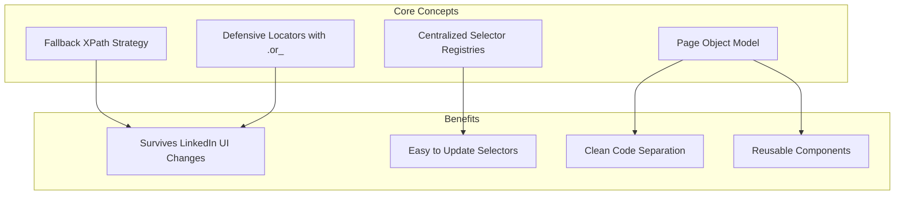

---

## License

MIT License - Use at your own risk. Be mindful of LinkedIn's Terms of Service.

---

## Disclaimer

This tool is for educational purposes. Automated access to LinkedIn may violate their Terms of Service. Use responsibly and consider rate limiting your requests.

