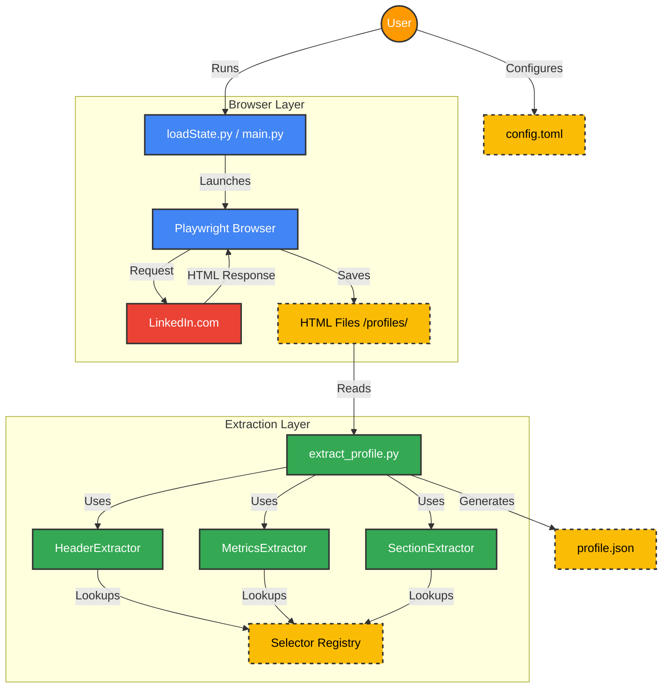
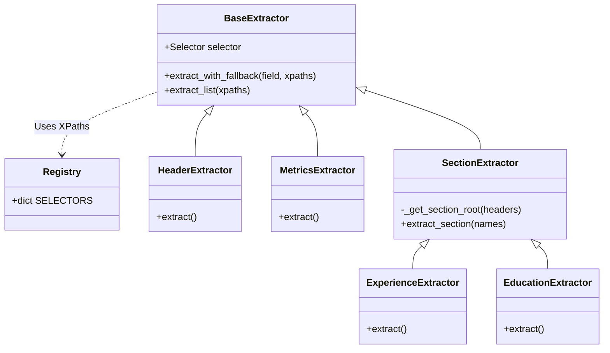
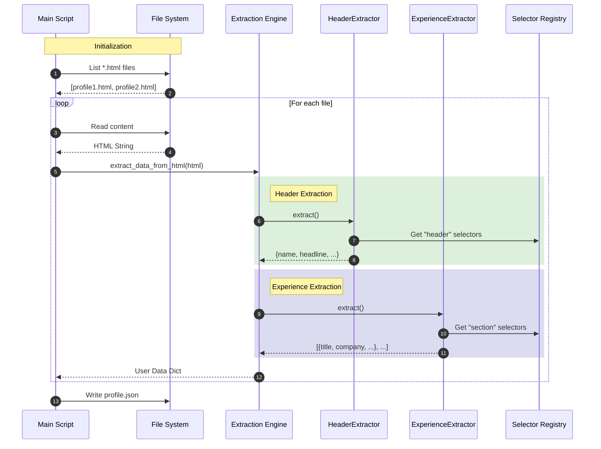

# System Architecture

## Overview
The LinkedIn Profile Extraction system is a modular Python application designed to scrape and parse LinkedIn profile data. It leverages **Playwright** for browser automation (handling login and page navigation) and a custom **Extractor Engine** for parsing HTML content into structured JSON.

## Key Components

### 1. Browser Automation (`loadState.py`)
- Manages the Playwright browser context.
- Handles user sessions and cookies.
- Navigates to profile URLs and dumps HTML content.

### 2. Extraction Engine (`extract_profile.py`)
- Reads HTML files from the disk.
- Orchestrates specific extractors for different profile sections.
- Produces normalized JSON output.

### 3. Extractor Modules (`extractors/`)
- **Registry**: Central repository of XPaths/Selectors.
- **BaseExtractor**: Abstraction for common extraction logic (fallback strategies, cleaning).
- **Specific Extractors**: Specialized classes for Headers, Metrics, Experience, Education, etc.

---

## Architecture Diagrams

### 1. System Context Diagram
This diagram illustrates the high-level data flow from the external LinkedIn website to the final JSON output.

### 2. Class Diagram (Extractor Module)
This diagram details the object-oriented structure of the extraction logic.

### 3. Execution Sequence Diagram
This diagram visualizes the runtime execution flow when `extract_profile.py` is triggered.

