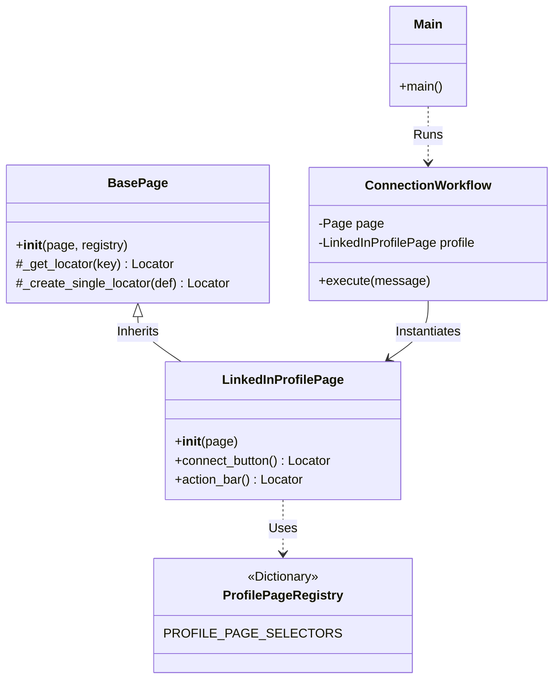
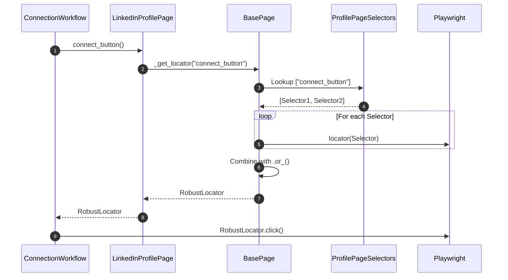

# LinkedIn Connection Automation Architecture

## Overview
This module provides a robust, asynchronous system for automating LinkedIn interactions, specifically focusing on sending connection requests. It leverages **Playwright** for browser automation and follows a modular design to separate concerns between browser management, page interactions, and business logic.

## Directory Structure

```text
linkedin/
├── main.py                 # Entry point: Orchestrates execution
├── browser.py              # Browser Factory: Manages Playwright context and config
├── linkedin_types.py       # Type Definitions: Enums for statuses
├── pages/
│   ├── base_page.py        # Base Page Object: Implements defensive selector logic
│   ├── profile_page.py     # Profile Page Object: Specific profile interactions
│   └── registries/         # Selector Registries
│       └── profile_page_registry.py # Selectors for the Profile Page
└── workflows/
    └── connection_workflow.py # Workflow: Business logic for connections
```

## Key Components

### 1. Browser Management (`browser.py`)
- **Responsibility**: Abstraction layer for Playwright browser initialization.
- **Features**:
    - Loads configuration from `config.toml`.
    - Function `launch_browser`: Creates a persistent context (saving cookies/session state).
    - Handles hybrid window sizing (Maximized + `viewport=None`) for realistic behavior.

### 2. Defensive Page Object Model (`pages/`)
The system uses an enhanced Page Object Model designed for stability against UI changes.

- **`BasePage` (`pages/base_page.py`)**:
    - **Core Logic**: Implements `_get_locator(key)`, which accepts a key from a registry.
    - **Defensive Strategy**: It iterates through a list of potential selectors (e.g., semantic button vs. specific XPath) and combines them using Playwright's `.or_()` method. This ensures that if *any* of the defined selectors are visible, the interaction succeeds.
    - **Reusability**: Designed to be inherited by specific page objects, which pass their own selector registry.

- **`LinkedInProfilePage` (`pages/profile_page.py`)**:
    - Inherits from `BasePage`.
    - Imports its specific selectors from `pages/registries/profile_page_registry.py`.
    - Provides semantic methods like `connect_button()` without worrying about *how* the button is found.

- **Registries (`pages/registries/`)**:
    - Pure Python dictionaries mapping logical names (e.g., `connect_button`) to lists of selector strategies.
    - Separates "Business Logic" (What to click) from "Implementation Details" (XPaths/Selectors).

### 3. Workflow Logic (`workflows/`)
- **`ConnectionWorkflow` (`workflows/connection_workflow.py`)**:
    - Implements the "business logic" of the automation.
    - **Logic Flow**:
        1. Analyzes page state to determine `ConnectionStatus` (Connected, Pending, Not Connected).
        2. Decides whether to send a request.
        3. Handles "Add Note" vs "Send without Note" scenarios.
        4. Handles fallback logic (e.g., checking the "More" menu if buttons are hidden).

### 4. Entry Point (`main.py`)
- Sets up the `asyncio` loop (handling Windows-specific policies).
- Injects the browser context into the Workflow.
- Executes the `ConnectionWorkflow`.

---

## Diagrams

### 1. Class Relationships
This diagram shows the class hierarchy and dependencies.



### 2. Execution Flow
The flow of execution remains similar, but the *selector resolution* is now delegated to the BasePage.


